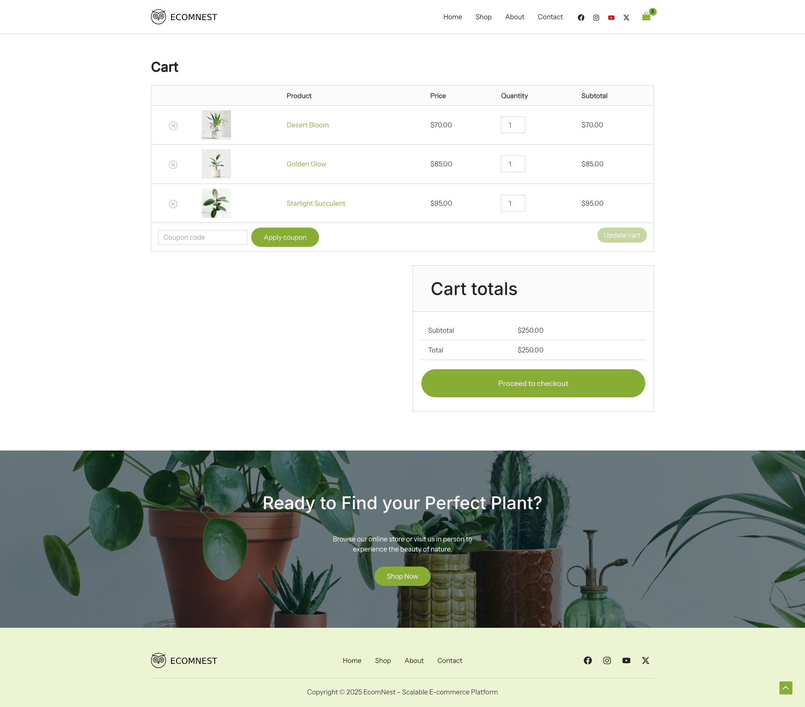

# EcomNest WP - WordPress E-commerce Website

A modern, feature-rich WordPress e-commerce website built with the latest technologies and optimized for performance, user experience, and conversions.

## 🚀 Features

### Core Platform
- **WordPress** - Latest stable version with optimized configuration
- **Astra Theme** - Fast, lightweight, and SEO-optimized theme
- **Astra Child Theme** - Custom theme modifications for enhanced functionality

### E-commerce & Sales
- **WooCommerce** - Complete e-commerce solution with product management, inventory, and order processing
- **CartFlows** - Advanced checkout optimization and sales funnel creation
- **Cart Abandonment Recovery** - Automated email campaigns to recover lost sales
- **Stripe Payment Gateway** - Secure credit card processing and payment management

### Design & User Experience
- **Elementor** - Drag-and-drop page builder for custom layouts
- **Header Footer Elementor** - Custom header and footer design capabilities
- **Presto Player** - Professional video player for product demos and tutorials
- **Responsive Design** - Mobile-first approach for all devices

### Communication & Marketing
- **WPForms Lite** - Contact forms and lead generation
- **SureMails** - Reliable email delivery system to prevent spam folder issues

### Performance & Optimization
- **Lightweight Theme** - Astra theme optimized for speed (< 50KB frontend)
- **SEO Optimized** - Built-in schema.org markup for search engines
- **Caching Ready** - Compatible with popular caching plugins
- **Translation Ready** - Multi-language support capabilities

## 🛠️ Technology Stack

### Backend
- **PHP** - Server-side scripting
- **MySQL** - Database management
- **WordPress Core** - Content management system

### Frontend
- **HTML5/CSS3** - Modern web standards
- **JavaScript** - Interactive functionality
- **Responsive Design** - Mobile-first approach

### E-commerce
- **WooCommerce** - E-commerce platform
- **Stripe API** - Payment processing
- **CartFlows** - Conversion optimization

### Development Tools
- **Elementor** - Visual page builder
- **Git** - Version control
- **MAMP** - Local development environment

## 📁 Project Structure

```
ecomnest-wp/
├── wp-content/
│   ├── plugins/
│   │   ├── woocommerce/          # E-commerce functionality
│   │   ├── elementor/            # Page builder
│   │   ├── cartflows/            # Checkout optimization
│   │   ├── checkout-plugins-stripe-woo/  # Payment gateway
│   │   ├── wpforms-lite/         # Contact forms
│   │   ├── woo-cart-abandonment-recovery/  # Email marketing
│   │   ├── presto-player/        # Video player
│   │   ├── suremails/            # Email delivery
│   │   ├── header-footer-elementor/  # Custom headers/footers
│   │   └── astra-sites/          # Theme templates
│   └── themes/
│       ├── astra/                # Parent theme
│       └── astra-child/          # Custom child theme
├── wp-admin/                      # WordPress administration
├── wp-includes/                   # WordPress core files
└── wp-config.php                  # Database configuration
```

## 🚀 Getting Started

### Prerequisites
- **PHP** 7.4 or higher
- **MySQL** 5.7 or higher
- **WordPress** 6.5 or higher
- **MAMP/XAMPP** for local development

### Installation
1. Clone the repository to your local development environment
2. Import the database using the provided SQL file
3. Update `wp-config.php` with your database credentials
4. Access the site through your local server

### Configuration
- Update site URL in WordPress settings
- Configure WooCommerce settings
- Set up Stripe payment gateway
- Configure email settings for SureMails
- Customize theme options in Astra


## 🔧 Key Features Explained

### E-commerce Capabilities
- **Product Management** - Add, edit, and organize products with categories and attributes
- **Inventory Control** - Track stock levels and manage inventory
- **Order Processing** - Complete order management from cart to fulfillment
- **Payment Processing** - Secure Stripe integration for credit card payments
- **Shipping Options** - Flexible shipping rates and methods

### Conversion Optimization
- **CartFlows** - Create high-converting checkout pages and sales funnels
- **Cart Abandonment Recovery** - Automated email campaigns to recover lost sales
- **A/B Testing** - Test different checkout flows for better conversions
- **Upsell/Cross-sell** - Increase average order value with strategic product suggestions

### User Experience
- **Responsive Design** - Optimized for all devices and screen sizes
- **Fast Loading** - Optimized for speed and performance
- **SEO Friendly** - Built-in search engine optimization features
- **Accessibility** - WCAG compliant design elements

### Marketing Tools
- **Email Marketing** - Cart abandonment recovery and customer communication
- **Contact Forms** - Lead generation and customer support
- **Video Content** - Product demonstrations and tutorials
- **Social Integration** - Share products and content on social media

## 🎯 Performance Optimizations

- **Lightweight Theme** - Astra theme optimized for speed
- **Minified Assets** - Compressed CSS and JavaScript files
- **Image Optimization** - WebP support and lazy loading
- **Caching Ready** - Compatible with popular caching plugins
- **CDN Ready** - Content delivery network compatible

## 🔒 Security Features

- **SSL Ready** - Secure HTTPS connections
- **WordPress Security** - Latest security updates and best practices
- **Payment Security** - PCI compliant payment processing
- **Data Protection** - GDPR compliant data handling

## 📈 Analytics & Tracking

- **WooCommerce Analytics** - Sales and customer insights
- **Google Analytics Ready** - Easy integration for website analytics
- **Conversion Tracking** - Monitor checkout and sales funnel performance
- **Email Analytics** - Track email campaign performance

## 🛠️ Maintenance

### Regular Updates
- Keep WordPress core updated
- Update plugins and themes regularly
- Monitor security patches
- Backup database and files regularly

### Performance Monitoring
- Monitor website speed
- Check for broken links
- Review analytics data
- Optimize images and content

## 📞 Support

For technical support or questions about this e-commerce website:
- Check WordPress documentation
- Review plugin documentation
- Contact the development team
- Refer to WooCommerce support resources

## 📄 License

This project is built on open-source software:
- WordPress (GPL v2)
- WooCommerce (GPL v3)
- Astra Theme (GPL v2)
- Various plugins (GPL compatible licenses)

---

**Note:** This README should be updated as new features are added or configurations change.

---

## 📸 Screenshots

### Homepage Preview

*Modern e-commerce homepage with hero slider, featured products, and optimized user experience*

### Shop Page

*Product catalog with filtering options, sorting, and grid/list view*

### Single Product Page

*Detailed product view with image gallery, description, pricing, and add to cart*

### Cart Page

*Shopping cart with product summary, quantity controls, and checkout button*
